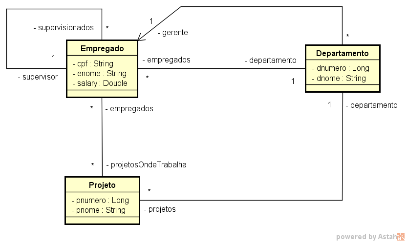

# SQL queries studies

The studies are based on <www.urionlinejudge.com.br> problems using Spring Boot.

JPA reference: <https://docs.spring.io/spring-data/jpa/docs/current/reference/html/#reference>

## Docker

run `docker.sh` to generate an image and run it with all databases

user: postgres

password: 1234567

databases:
- uri2602
- uri2609
- uri2611
- uri2621
- uri2737
- uri2990

## uri2602

Concepts:
- Projections
- Native SQL queries

References:
- <https://www.baeldung.com/spring-data-jpa-projections>
- <https://docs.spring.io/spring-data/jpa/docs/current/reference/html/#projections>

## uri2611

Concepts:
- Inner join in native query
- Inner join in JPQL query

# uri2621

Concepts:
- LIKE and BETWEEN usage in native query
- LIKE and BETWEEN usage in JPQL query

# uri2609

Concepts:
- GROUP BY in native query
- GROUP BY in JPQL query

# uri2737

Concepts:
- UNION in native query

# uri2990

Concepts:
- LEFT JOIN in native query
- NOT IN with subquery in native query

Diagram:

